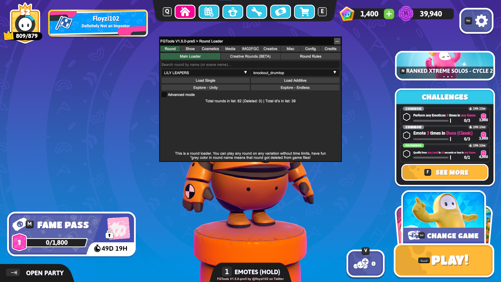
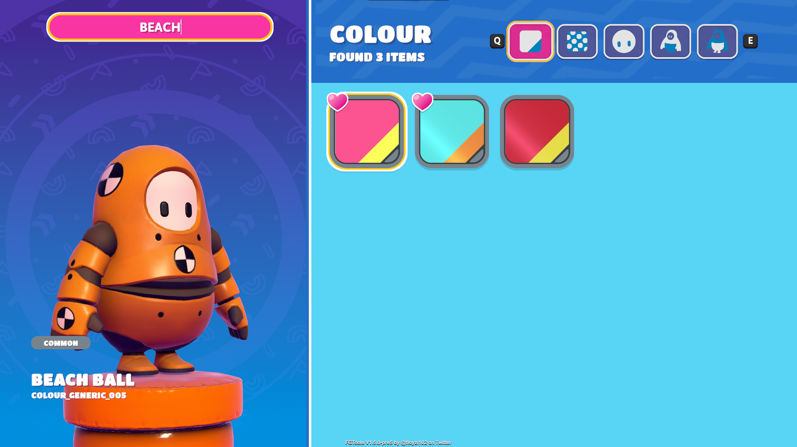
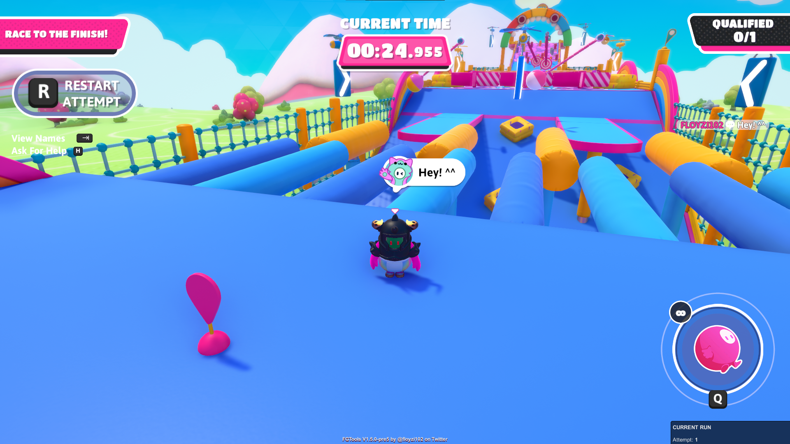
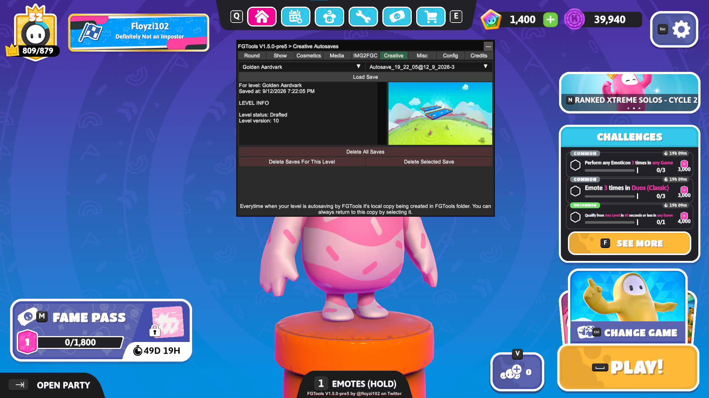

# FGTools
Fall Guys mod that adds additional features to the game

## Showcase
|      |      |
| :--: | :--: |
| FGTools UI |  Locker Search 
| Round Loader with speedrun mode |  Creative Local Saves Browser

## Features
### As of now...
- General
- - Search in locker
- - All cosmetics unlocker (client side)
- - Menu theme selector
- - Loadout presets
- - Discord RPC
- Round Loader
- - Speedrun mode
- - Round rules
- - Local explore
- - Show loader
- - Free camera mode
- Creative
- - Autosave system
- - On device level backups
- - IMG to Creative level converter (deprecated)
- Much more minor changes and improvements, see them yourself!
### In Development ™...
- LAN multiplayer

## Installation
### Via FGLauncher
- Get the latest release of FG Launcher
- Extract it into any directory
- Launch FGLauncher executable and follow instructions you provided
### Manual
- Download the Latest Release of the mod
- Download the latest [BepInEx Bleeding Edge](https://builds.bepinex.dev/projects/bepinex_be) build for Unity Il2Cpp X64
- Locate your Fall Guys installation directory
- Drop everything from BepInEx release you downloaded earlier into Fall Guys folder
- In Fall Guys directory open `FallGuys_client.ini` in any text editor like notepad (check if you have file extensions enabled if you don't see it)
- - Change first line of the file (`TargetApplicationPath`) from `start_protected_game.exe` to `FallGuys_client_game.exe` then save the file (in notepad: File -> Save or `CTRL+S`)
- In Fall Guys directory follow this path: `BepInEx/plugins` (if `plugins` directory doesn't exist create it manually)
- Drop everything from the Latest Release of the mod into `plugins` directory
- You're all set! Launch the game via launcher

## Deinstallation
> [!WARNING]
> These instructions are general BepInEx disabling instructions! If you only need to remove FGTools but keep other mods you have just remove FGTools directory from BepInEx/plugins
### Via FGLauncher
- On your Fall Guys slot click on the Toggle Mods button
### Manual
- In Fall Guys directory open `FallGuys_client.ini` in any text editor like notepad (check if you have file extensions enabled if you don't see it)
- - Change first line of the file (`TargetApplicationPath`) from `FallGuys_client_game.exe` to `start_protected_game.exe` then save the file (in notepad: File -> Save or `CTRL+S`)
- Delete BepInEx entry file `winhttp.dll` from the Fall Guys directly

## Still need help?
- Check out my [Usage Tutorial](https://youtube.com/watch?v=eShQOpZkjFw), it covers installation and deinstallation of the mod and provides basic usage instructions. Even though it may be a bit outdated in general everything is almost the same as it was
- If you still need help ask for it in the [Discord Server](https://dsc.gg/obedguys)

## Acknowledgements
### FGTools Development
- Kota - General help with code, some Creative Expansion Pack code
- [RRM1](https://github.com/RRM101) - General help with code, some [fallguyloadr](https://github.com/RRM101/fallguyloadr) code
### FGTools Localizators
- XiaoBai / Fall Guy 0294 - translated FGTools on Chinese
- ArenaCloser12 - translated FGTools on Korean
- Nemui_gamer - translated FGTools on Japanese
- ItzAqua! - translated FGTools on Spanish
- English & Russian were translated by me
### Other
- Special thanks to [sinai-dev](https://github.com/sinai-dev) who made [Unity Explorer](https://github.com/sinai-dev/UnityExplorer) and [Universe Lib](https://github.com/sinai-dev/UniverseLib)
- Special thanks to [yukieiji](https://github.com/yukieiji) for keeping [Unity Explorer](https://github.com/yukieiji/UnityExplorer) and [Universe Lib](https://github.com/yukieiji/UniverseLib) updated
- Special thanks to [repinek](https://github.com/repinek) for creating [IMG To FGC](https://github.com/repinek/ImgToFGC)

## Building
TODO

## FAQ
### Can I play online with FGTools
Yes! FGTools alone allows you to play online matches with the mod. If you can't play online look for other mods that may interfere FGTools work or check if Fall Guys servers are up and your internet connection is fine

### Can I get ban for using FGTools
No. All bans in Fall Guys are tied up to user reports, when you're using FGTools you appear the same as if you played without mods for other players, this means there are no reason to report you. But remember that using mods is always a risk, even though Fall Guys Devs never banned anyone who used mods before the chances are never equal to zero

### Why I appear as a console player
FGTools, as any other Fall Guys mod that allow you to play online, spoofs your platform to console to prevent the server from disconnecting you from the match. Unfortunately, you can't change that

### Is there any mobile analog of the FGTools
Yes! Check out [FGTools Mobile](https://gitlab.com/floyzi/fgtoolsmobile), it was made only for android devices, if you're using iOS there are no alternative, im sorry

### My question is not on the list...
You can always ask it in the [Discord Server](https://dsc.gg/obedguys). Just make sure it's not dumb!

## License
